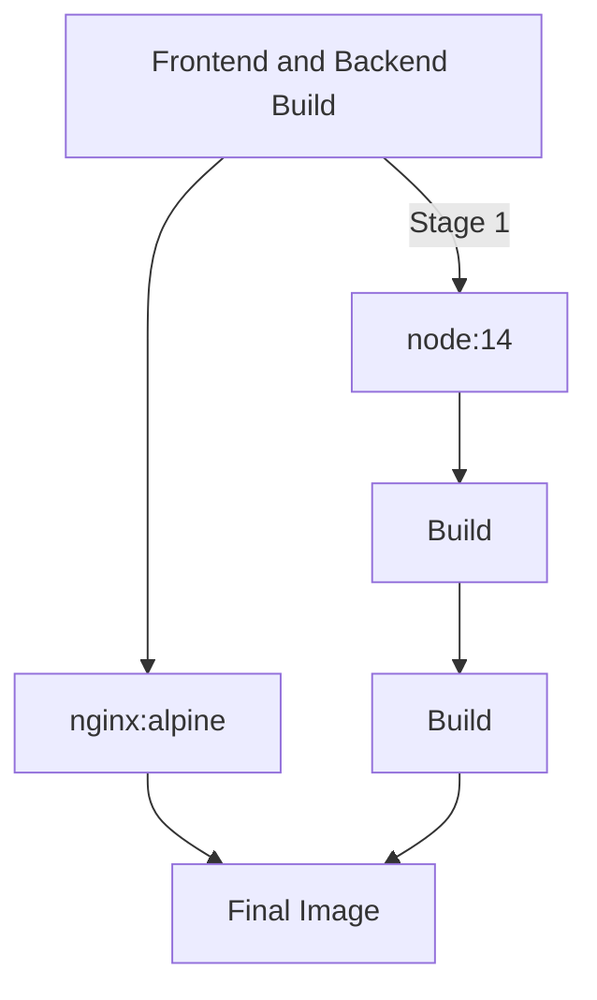
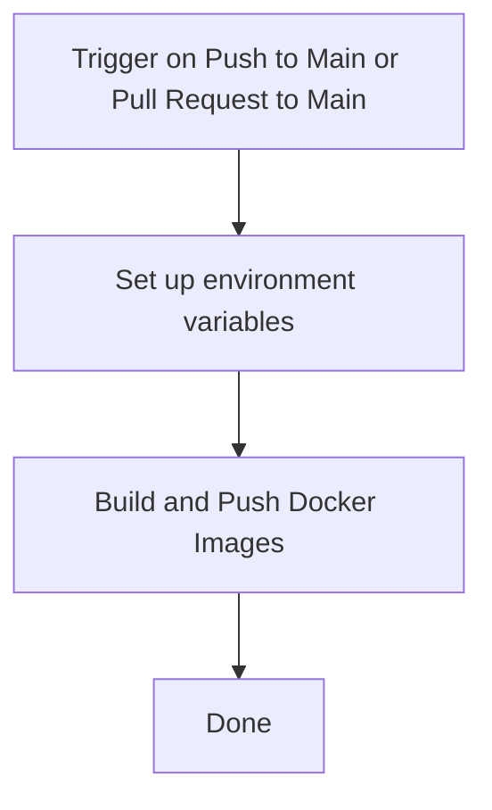

# pern-stack-docker-compose

# Backend

This code provides a basic API server with CRUD functionality for managing "departments" in a database. The server can handle requests to create, read, update, and delete department records, making it suitable for building a simple web application or backend service. 

# Frontend


# Dockerfile

## Docker Build Stages and Layers
The Dockerfile defines a multi-stage build, which is a recommended best practice for optimizing the final image size and improving security.

The Mermaid diagram below visually represents the Docker build stages and the resulting image layers:



## Explanation
The Dockerfile consists of two main stages:

### Stage 1 (Frontend and Backend Build):

It uses the official node:14 image as the base image and sets the working directory to /usr/src.
Copies the frontend and backend files into the container.
Builds the frontend using npm install and npm run build.
Builds the backend using npm i and npm run build with the ENVIRONMENT set to production.
The resulting build artifacts (frontend and backend) are available in this stage.

### Stage 2 (Nginx to serve frontend and proxy to backend):

It uses the official nginx:alpine image as the base image and sets the working directory to /usr/share/nginx/html.
Removes the default Nginx static files to ensure a clean slate.
Copies the built frontend files from the previous stage (build directory) to the Nginx container.
Copies the Nginx configuration file (nginx.conf) to serve the frontend and proxy API requests to the backend.
Exposes port 3000, which is the desired frontend port.
Exposes port 5001, which is the desired backend port.
The final image now contains only the production-ready frontend files and the Nginx configuration.
The use of multi-stage builds helps to keep the final image small and secure. The build stage (node:14) is separate from the production stage (nginx:alpine), and only necessary artifacts are copied to the final image.

The exposed ports (3000 and 5001) provide information to users about which ports are used by the application.

The CMD ["nginx", "-g", "daemon off;"] command is executed when the container is started. It runs Nginx in the foreground to serve the frontend and proxy API requests to the backend.


# Dockerfile

## Stage 1: Frontend and Backend Build
```go
FROM node:14 AS build
WORKDIR /usr/src
```

### Copying both frontend and backend files
```go
COPY frontend/ ./frontend/
COPY backend/ ./backend/
```

### Building frontend
```go
RUN cd frontend && npm install && npm run build
```

### Building backend
```go
RUN cd backend && npm i && ENVIRONMENT=production npm run build
```

## Stage 2: Nginx to serve frontend and proxy to backend
```go
FROM nginx:alpine
WORKDIR /usr/share/nginx/html
```

### Remove default Nginx static files
```go
RUN rm -rf ./*
```

### Copy the built frontend files from the previous stage
```go
COPY --from=build /usr/src/frontend/build .
```

### Copy Nginx configuration to serve the frontend and proxy to backend
```go
COPY nginx/nginx.conf /etc/nginx/conf.d/default.conf
```

### Expose the desired frontend port (3000)
```go
EXPOSE 3000
```

### Expose the desired backend port (5001)
```go
EXPOSE 5001
```
### Start Nginx
```go
CMD ["nginx", "-g", "daemon off;"]
```

---

[](https://github.com/DouglasVDM/pern-stack-docker-compose/actions/workflows/main-build-and-test.yml)

---

# Docker Image CI Workflow

This GitHub Actions workflow builds and pushes Docker images for the frontend and backend of the application to Docker Hub. The build process uses a multi-stage Dockerfile to ensure a clean and efficient build for the production-ready images.

## Workflow Overview

The following Mermaid diagram illustrates the workflow steps:




## Detailed Steps

## Set up environment variables
The workflow sets up environment variables for the Docker image tags based on the SHA of the commit. This ensures that each build gets a unique tag.

```.yml
name: Docker Image CI

on:  
  push:
    branches:
      - main
    paths:
      - 'frontend/**' # Only trigger for changes in the frontend directory
      - 'backend/**'  # Only trigger for changes in the backend directory
  pull_request:
    branches:
      - main

jobs:
  build:
    runs-on: ubuntu-latest

    steps:
      - uses: actions/checkout@v3

      - name: Set up environment variables
        run: |
            # Set IMAGE_TAG_FE and IMAGE_TAG_BE environment variables
            echo "IMAGE_TAG_FE=douglasvdmerwe/dev-app-image:${{ github.sha }}" >> $GITHUB_ENV
            echo "IMAGE_TAG_BE=douglasvdmerwe/dev-api-image:${{ github.sha }}" >> $GITHUB_ENV
```

## Build and Push Docker Images

The workflow builds the Docker images for the frontend and backend using the multi-stage Dockerfile. It then tags and pushes the images to Docker Hub.

```.yml
      - name: Build and Push Docker Images
        run: |
          # Build frontend Docker image and tag it
          docker build ./ --file Dockerfile --tag ${{ env.IMAGE_TAG_FE }} --target build
          
          # Build backend Docker image and tag it
          docker build ./ --file Dockerfile --tag ${{ env.IMAGE_TAG_BE }} --target build
          
          # Login to Docker Hub with provided credentials
          docker login -u ${{ secrets.DOCKERHUB_USERNAME }} -p ${{ secrets.DOCKERHUB_TOKEN }}
          
          # Push frontend Docker image to Docker Hub
          docker push ${{ env.IMAGE_TAG_FE }}
          
          # Push backend Docker image to Docker Hub
          docker push ${{ env.IMAGE_TAG_BE }}
```

## Done
Once the images are successfully pushed to Docker Hub, the workflow is complete.

## Workflow Configuration

To use this workflow, create a YAML file (e.g., `.github/workflows/docker-image.yml`) in your repository with the content shown above. Make sure to replace `douglasvdmerwe` with your Docker Hub username and set up the `DOCKERHUB_USERNAME` and `DOCKERHUB_TOKEN` secrets in your GitHub repository.

For more information on GitHub Actions and workflows, refer to the [GitHub Actions documentation](https://docs.github.com/en/actions).

