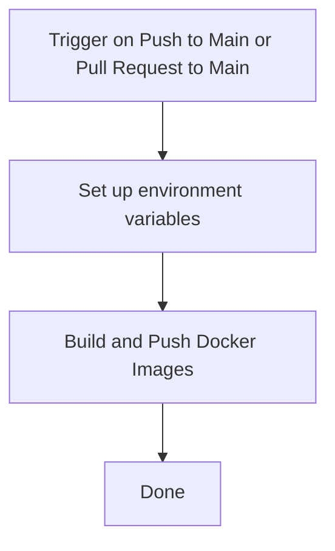

# pern-stack-docker-compose

[](https://github.com/DouglasVDM/pern-stack-docker-compose/actions/workflows/main-build-and-test.yml)

# Docker Image CI Workflow

This GitHub Actions workflow builds and pushes Docker images for the frontend and backend of the application to Docker Hub. The build process uses a multi-stage Dockerfile to ensure a clean and efficient build for the production-ready images.

## Workflow Overview

The following Mermaid diagram illustrates the workflow steps:




## Detailed Steps

## Set up environment variables
The workflow sets up environment variables for the Docker image tags based on the SHA of the commit. This ensures that each build gets a unique tag.

```.yml
name: Docker Image CI

on:  
  push:
    branches:
      - main
    paths:
      - 'frontend/**' # Only trigger for changes in the frontend directory
      - 'backend/**'  # Only trigger for changes in the backend directory
  pull_request:
    branches:
      - main

jobs:
  build:
    runs-on: ubuntu-latest

    steps:
      - uses: actions/checkout@v3

      - name: Set up environment variables
        run: |
            # Set IMAGE_TAG_FE and IMAGE_TAG_BE environment variables
            echo "IMAGE_TAG_FE=douglasvdmerwe/dev-app-image:${{ github.sha }}" >> $GITHUB_ENV
            echo "IMAGE_TAG_BE=douglasvdmerwe/dev-api-image:${{ github.sha }}" >> $GITHUB_ENV
```

## Build and Push Docker Images

The workflow builds the Docker images for the frontend and backend using the multi-stage Dockerfile. It then tags and pushes the images to Docker Hub.

```.yml
      - name: Build and Push Docker Images
        run: |
          # Build frontend Docker image and tag it
          docker build ./ --file Dockerfile --tag ${{ env.IMAGE_TAG_FE }} --target build
          
          # Build backend Docker image and tag it
          docker build ./ --file Dockerfile --tag ${{ env.IMAGE_TAG_BE }} --target build
          
          # Login to Docker Hub with provided credentials
          docker login -u ${{ secrets.DOCKERHUB_USERNAME }} -p ${{ secrets.DOCKERHUB_TOKEN }}
          
          # Push frontend Docker image to Docker Hub
          docker push ${{ env.IMAGE_TAG_FE }}
          
          # Push backend Docker image to Docker Hub
          docker push ${{ env.IMAGE_TAG_BE }}
```

## Done
Once the images are successfully pushed to Docker Hub, the workflow is complete.

## Workflow Configuration

To use this workflow, create a YAML file (e.g., `.github/workflows/docker-image.yml`) in your repository with the content shown above. Make sure to replace `douglasvdmerwe` with your Docker Hub username and set up the `DOCKERHUB_USERNAME` and `DOCKERHUB_TOKEN` secrets in your GitHub repository.

For more information on GitHub Actions and workflows, refer to the [GitHub Actions documentation](https://docs.github.com/en/actions).

