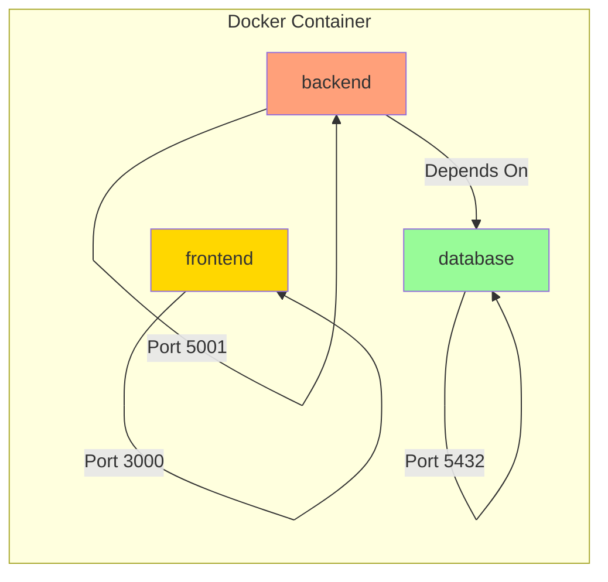
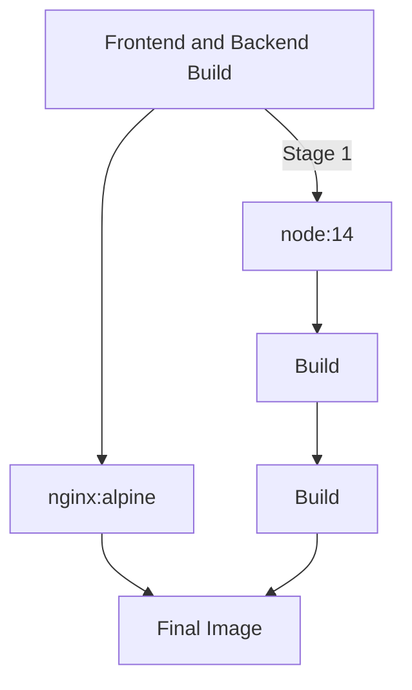
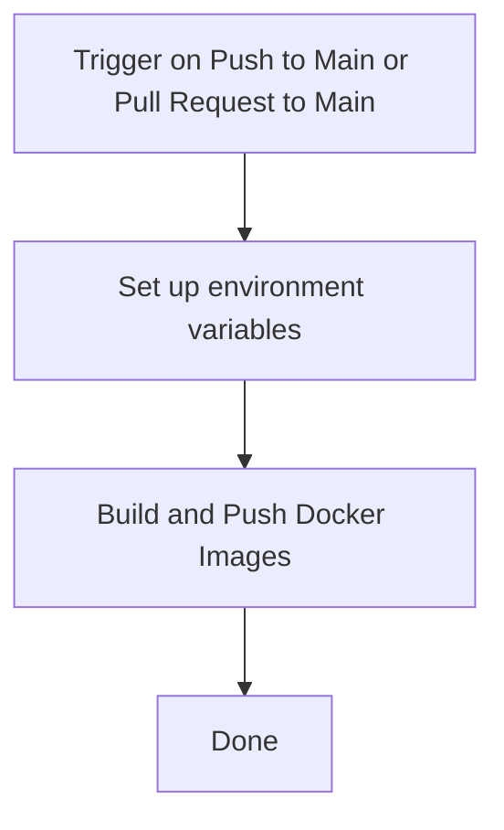

# Table of Contents

1. [Deployed App](#deployed-app)
2. [Docker Compose Configuration for Dev Environment](#docker-compose-configuration-for-dev-environment)   
    a. [Frontend Service](#frontend-service)   
    b. [Backend Service](#backend-service)   
    c. [Database Service](#database-service)   
3. [Frontend Summary](#frontend-summary)
4. [Backend Summary](#backend-summary)
5. [Dockerfile](#dockerfile)
6. [Docker Image CI Workflow](#docker-image-ci-workflow)   
7. [Jenkins Pipeline Configuration](#jenkins-pipeline-configuration)

# Deployed App

### [Pern Stack Docker Compose App](https://tinyurl.com/pern-stack-docker-compose)
```
Due to using a free hosting service, loading the app may take a few minutes...
```

# Docker Compose Configuration for Dev Environment

This repository contains a Docker Compose configuration file (`docker-compose.yml`) to set up a development environment with three services: `frontend`, `backend`, and `database`.

## Frontend Service

- Image: The frontend service uses the image `douglasvdmerwe/dev-app-image` with a version specified by the environment variable `IMAGE_TAG_FE`.
- Container Name: The container for the frontend service is named `app-container`.
- Ports: The service is mapped to listen on port `3000` of the host machine, forwarding requests to port `3000` inside the container.
- Restart Policy: The container will automatically restart unless stopped intentionally.
- Environment Variables: The `NODE_ENV` environment variable is set to `production` for the Node.js environment.

## Backend Service

- Image: The backend service uses the image `douglasvdmerwe/dev-api-image` with a version specified by the environment variable `IMAGE_TAG_BE`.
- Container Name: The container for the backend service is named `api-container`.
- Ports: The service is mapped to listen on port `5001` of the host machine, forwarding requests to port `5001` inside the container.
- Restart Policy: The container will automatically restart unless stopped intentionally.
- Environment Variables: The `POSTGRES_USER` and `POSTGRES_PASSWORD` environment variables are set to secrets defined in the repository.
- Depends On: The backend service depends on the `database` service, so it will wait for the database to be ready before starting.

## Database Service

- Image: The database service uses the official PostgreSQL image with version `12.8-alpine`.
- Container Name: The container for the database service is named `db-container`.
- Ports: The service is mapped to listen on port `5432` of the host machine, forwarding requests to port `5432` inside the container.
- Restart Policy: The container will automatically restart unless stopped intentionally.
- Environment Variables: The `POSTGRES_USER` and `POSTGRES_PASSWORD` environment variables are set to values specified in the repository.
- Volumes: A volume named `data` is used to persist the database data in the `/var/lib/postgresql/data` directory.

**Note**: The Docker Compose file is designed to set up a development environment for the frontend and backend applications, along with a PostgreSQL database. The environment variables and secrets are used to configure the services securely and efficiently.

> The code above specifies a Docker Compose configuration for a development environment.   
> The `docker-compose.yml` file sets up three services: `frontend`, `backend`, and `database`, each running in its own container.   
> The `frontend` service listens on port `3000`, the `backend` service listens on port `5001`, and the `database` service listens on port `5432`.   
> The services are set to automatically restart unless intentionally stopped.   
> The `backend` service depends on the `database` service, ensuring that the database is ready before starting the backend.   
> Environment variables are used to configure the services, including sensitive information like passwords, which are stored as secrets in the repository.   
> The `data` volume is used to persist the database data.
> This configuration allows developers to work on the frontend and backend components with a pre-configured and isolated development environment.   

Here's the Docker Compose configuration represented as a Mermaid diagram:



The diagram shows three services represented as nodes: frontend, backend, and database. The arrows indicate the ports that each service listens on. The backend service depends on the database service, ensuring that the database is ready before the backend starts. Each service runs in its Docker container, isolated from the host system. The colors represent different service categories for better visualization.

In simple terms, this code defines how different parts of a multi-container application should be set up and work together. The frontend service is responsible for the user interface, the backend service handles the application logic and communication with the database, and the database service stores the data used by the application. The code ensures that the containers for each service run on specific ports and have access to required environment variables and dependencies for smooth operation.

## Frontend Summary:
The frontend code is like the "face" of a website or app that users interact with. It's built using a library called React, which helps make things look nice and respond to what users do. The app has two main parts:

Input Box: This is where users can type and add new department names. When they type something and click a button, the app sends the new department name to the backend server to save it.

List of Departments: This part shows all the department names that are already saved. It gets the list from the backend server and displays it on the screen.

When you open the app, it will show a list of departments that are already saved. If you want to add a new department, type its name in the box and click the button to save it. The list will automatically update to show the new department you added.

## Backend Summary:
The backend code is like the "brain" behind the app. It's responsible for storing and handling data. The code is written in Node.js, a programming language for servers. The backend has a few important tasks:

Storing Departments: When the frontend app sends a new department name, the backend saves it in a database. This way, the app can remember the departments even when you close it.

Fetching Departments: When the frontend app wants to show the list of departments, it asks the backend for the data. The backend gets the list from the database and sends it back to the frontend, which then displays it.

Updating and Deleting Departments: If you want to change a department's name or remove it, the frontend app asks the backend to do that. The backend finds the department you want to update or delete in the database and makes the necessary changes.

In simple terms, the frontend makes the app look nice and lets you interact with it, while the backend takes care of saving, fetching, and managing the data behind the scenes. Together, they work as a team to provide a smooth and functional user experience.

# Backend

This code is for creating a simple API server using the Express framework in Node.js. The server allows you to perform CRUD operations (Create, Read, Update, Delete) on a "departments" table in a database.

Overall, this is a basic API server that allows you to interact with the "departments" table by creating, reading, updating, and deleting department records through HTTP requests.

# Frontend

This code represents a web application built using React, a popular JavaScript library for creating user interfaces.

Overall, this React app communicates with a backend server to fetch and display a list of departments. The InputDepartment component handles adding new departments, and the ListDepartments component displays the current departments. It demonstrates how React components, hooks, and state management work together to build dynamic user interfaces.

# Dockerfile

## Docker Build Stages and Layers
The Dockerfile defines a multi-stage build, which is a recommended best practice for optimizing the final image size and improving security.

The Mermaid diagram below visually represents the Docker build stages and the resulting image layers:



## Explanation
The Dockerfile consists of two main stages:

### Stage 1 (Frontend and Backend Build):

It uses the official node:14 image as the base image and sets the working directory to /usr/src.
Copies the frontend and backend files into the container.
Builds the frontend using npm install and npm run build.
Builds the backend using npm i and npm run build with the ENVIRONMENT set to production.
The resulting build artifacts (frontend and backend) are available in this stage.

### Stage 2 (Nginx to serve frontend and proxy to backend):

It uses the official nginx:alpine image as the base image and sets the working directory to /usr/share/nginx/html.
Removes the default Nginx static files to ensure a clean slate.
Copies the built frontend files from the previous stage (build directory) to the Nginx container.
Copies the Nginx configuration file (nginx.conf) to serve the frontend and proxy API requests to the backend.
Exposes port 3000, which is the desired frontend port.
Exposes port 5001, which is the desired backend port.
The final image now contains only the production-ready frontend files and the Nginx configuration.
The use of multi-stage builds helps to keep the final image small and secure. The build stage (node:14) is separate from the production stage (nginx:alpine), and only necessary artifacts are copied to the final image.

The exposed ports (3000 and 5001) provide information to users about which ports are used by the application.

The CMD ["nginx", "-g", "daemon off;"] command is executed when the container is started. It runs Nginx in the foreground to serve the frontend and proxy API requests to the backend.


# Dockerfile

## Stage 1: Frontend and Backend Build
```go
FROM node:14 AS build
WORKDIR /usr/src
```

### Copying both frontend and backend files
```go
COPY frontend/ ./frontend/
COPY backend/ ./backend/
```

### Building frontend
```go
RUN cd frontend && npm install && npm run build
```

### Building backend
```go
RUN cd backend && npm i && ENVIRONMENT=production npm run build
```

## Stage 2: Nginx to serve frontend and proxy to backend
```go
FROM nginx:alpine
WORKDIR /usr/share/nginx/html
```

### Remove default Nginx static files
```go
RUN rm -rf ./*
```

### Copy the built frontend files from the previous stage
```go
COPY --from=build /usr/src/frontend/build .
```

### Copy Nginx configuration to serve the frontend and proxy to backend
```go
COPY nginx/nginx.conf /etc/nginx/conf.d/default.conf
```

### Expose the desired frontend port (3000)
```go
EXPOSE 3000
```

### Expose the desired backend port (5001)
```go
EXPOSE 5001
```
### Start Nginx
```go
CMD ["nginx", "-g", "daemon off;"]
```

---

# Docker Image CI Workflow

This GitHub Actions workflow builds and pushes Docker images for the frontend and backend of the application to Docker Hub. The build process uses a multi-stage Dockerfile to ensure a clean and efficient build for the production-ready images.

## Workflow Overview

The following Mermaid diagram illustrates the workflow steps:




## Detailed Steps

## Set up environment variables
The workflow sets up environment variables for the Docker image tags based on the SHA of the commit. This ensures that each build gets a unique tag.

```.yml
name: Docker Image CI

on:  
  push:
    branches:
      - main
    paths:
      - 'frontend/**' # Only trigger for changes in the frontend directory
      - 'backend/**'  # Only trigger for changes in the backend directory
  pull_request:
    branches:
      - main

jobs:
  build:
    runs-on: ubuntu-latest

    steps:
      - uses: actions/checkout@v3

      - name: Set up environment variables
        run: |
            # Set IMAGE_TAG_FE and IMAGE_TAG_BE environment variables
            echo "IMAGE_TAG_FE=douglasvdmerwe/dev-app-image:${{ github.sha }}" >> $GITHUB_ENV
            echo "IMAGE_TAG_BE=douglasvdmerwe/dev-api-image:${{ github.sha }}" >> $GITHUB_ENV
```

## Build and Push Docker Images

The workflow builds the Docker images for the frontend and backend using the multi-stage Dockerfile. It then tags and pushes the images to Docker Hub.

```.yml
      - name: Build and Push Docker Images
        run: |
          # Build frontend Docker image and tag it
          docker build ./ --file Dockerfile --tag ${{ env.IMAGE_TAG_FE }} --target build
          
          # Build backend Docker image and tag it
          docker build ./ --file Dockerfile --tag ${{ env.IMAGE_TAG_BE }} --target build
          
          # Login to Docker Hub with provided credentials
          docker login -u ${{ secrets.DOCKERHUB_USERNAME }} -p ${{ secrets.DOCKERHUB_TOKEN }}
          
          # Push frontend Docker image to Docker Hub
          docker push ${{ env.IMAGE_TAG_FE }}
          
          # Push backend Docker image to Docker Hub
          docker push ${{ env.IMAGE_TAG_BE }}
```

## Done
Once the images are successfully pushed to Docker Hub, the workflow is complete.

## Workflow Configuration

To use this workflow, create a YAML file (e.g., `.github/workflows/docker-image.yml`) in your repository with the content shown above. Make sure to replace `douglasvdmerwe` with your Docker Hub username and set up the `DOCKERHUB_USERNAME` and `DOCKERHUB_TOKEN` secrets in your GitHub repository.

For more information on GitHub Actions and workflows, refer to the [GitHub Actions documentation](https://docs.github.com/en/actions).

## Jenkins Pipeline Configuration

This repository contains a Jenkins pipeline configuration written in a declarative syntax. The pipeline defines a series of stages to automate the build, test, and publishing process for a Docker image.

### Pipeline Stages

1. **Init Stage**: This stage is responsible for initializing the pipeline. It echoes a message to indicate the pipeline's start and displays information about the current build, such as `BUILD_ID` and `JENKINS_URL`.

2. **Build Stage**: This stage builds a Docker image for the application. It echoes the Docker build command that is being executed and runs the command using the Jenkins `sh` step. The image is tagged with `douglasvdmerwe/dev-app-image` and the `BUILD_ID`, ensuring a unique image for each build.

3. **Test Stage**: In this stage, testing of the application takes place. The pipeline echoes a message indicating the start of testing and then runs the required test commands. In this case, the pipeline simply displays a message "Testing.." and "Running pytest..", but in a real-world scenario, this stage would include actual tests for the application.

4. **Publish Stage**: The publish stage handles the publication of the Docker image to a container registry or a Docker repository. In this case, the pipeline echoes a message indicating the start of the publishing process and runs the Docker push command. However, the actual push command is not provided in the snippet.

5. **Cleanup Stage**: The cleanup stage is responsible for cleaning up the environment after the build and publish process. It echoes a message to indicate the start of cleanup and runs the Docker rmi (remove image) command. Just like the publish stage, the actual rmi command is not given in the snippet.

### Agent Configuration

The Jenkins pipeline is set up to use a Docker agent with the image 'docker:dind', which stands for Docker-in-Docker. The `args '--privileged'` argument is included to enable privileged access to the Docker daemon, which is necessary for running Docker commands within the Docker agent.

Please note that the provided code snippet is just a partial representation of a Jenkins pipeline configuration. The full pipeline definition may include additional configuration details, environment variables, and actual test and publish commands as per the project requirements.

> The Jenkins pipeline in this repository is designed to automate the build, test, and publish process for a Docker image.   
> The pipeline consists of several stages: `Init`, `Build`, `Test`, `Publish`, and `Cleanup`.   
> Each stage performs specific tasks, such as initialization, building the Docker image, running tests, and publishing the image to a container registry.   
> The pipeline uses a Docker agent with the image 'docker:dind', granting Docker-in-Docker access, and enabling Docker commands within the pipeline.   
> The pipeline provides an automated and reliable approach for managing the development, testing, and deployment of Dockerized applications.   

